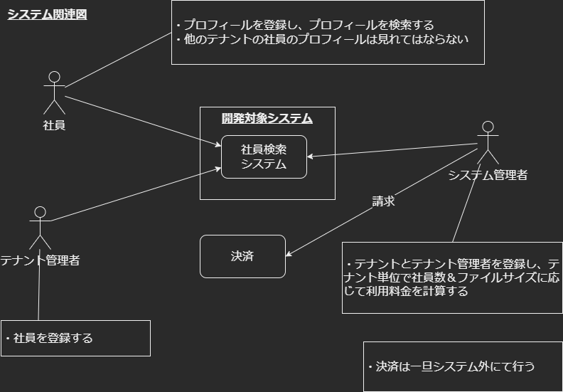
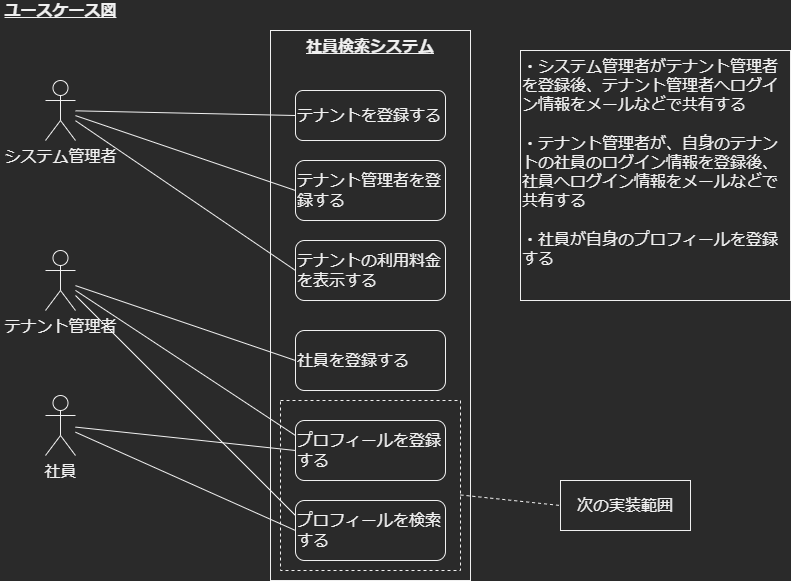
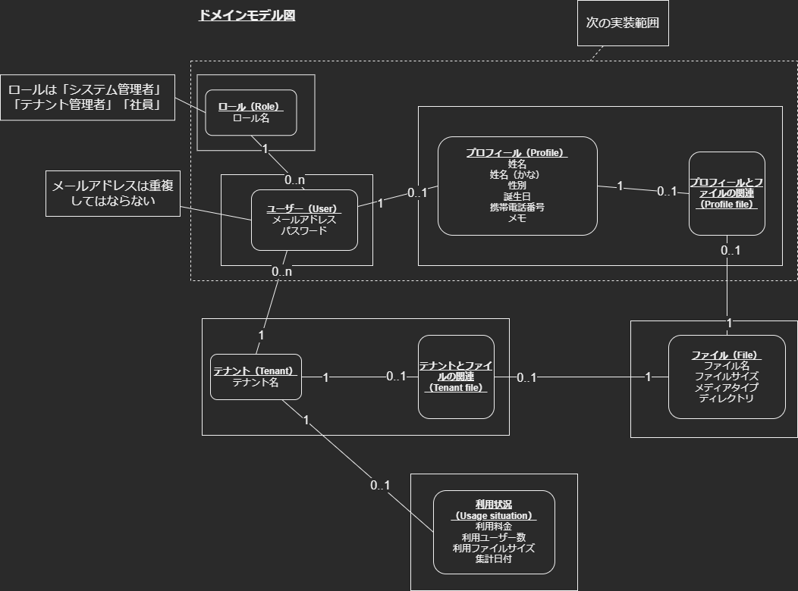
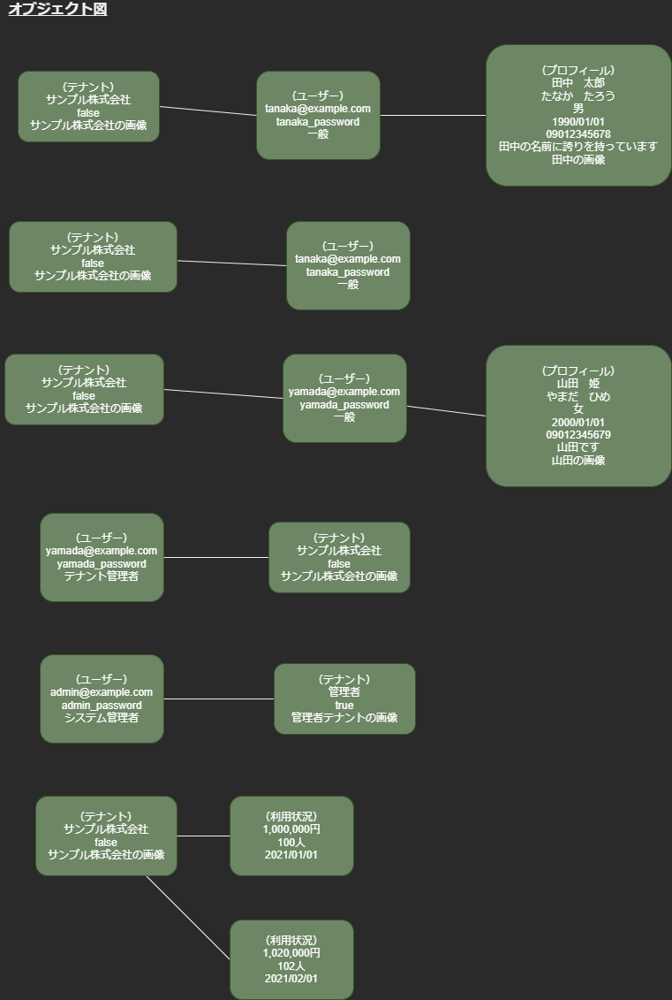

# CakePHP Application Skeleton


[](https://packagist.org/packages/cakephp/app)
[](https://github.com/phpstan/phpstan)

A skeleton for creating applications with [CakePHP](https://cakephp.org) 4.x.

The framework source code can be found here: [cakephp/cakephp](https://github.com/cakephp/cakephp).

## Installation

1. Download [Composer](https://getcomposer.org/doc/00-intro.md) or update `composer self-update`.
2. Run `php composer.phar create-project --prefer-dist cakephp/app [app_name]`.

If Composer is installed globally, run

```bash
composer create-project --prefer-dist cakephp/app
```

In case you want to use a custom app dir name (e.g. `/myapp/`):

```bash
composer create-project --prefer-dist cakephp/app myapp
```

You can now either use your machine's webserver to view the default home page, or start
up the built-in webserver with:

```bash
bin/cake server -p 8765
```

Then visit `http://localhost:8765` to see the welcome page.

## Update

Since this skeleton is a starting point for your application and various files
would have been modified as per your needs, there isn't a way to provide
automated upgrades, so you have to do any updates manually.

## Configuration

Read and edit the environment specific `config/app_local.php` and setup the
`'Datasources'` and any other configuration relevant for your application.
Other environment agnostic settings can be changed in `config/app.php`.

## Layout

The app skeleton uses [Milligram](https://milligram.io/) (v1.3) minimalist CSS
framework by default. You can, however, replace it with any other library or
custom styles.

## はじめにやること

1. ソースダウンロード

    ```bash
    git clone 'https://github.com/q23isline/reinventing_the_wheel.git'
    ```

2. `config/.env.example`をコピーし、`config/.env`として貼り付ける
    - `SECURITY_SALT`の値は適当に書き換える
3. `config/app_local.example.php`をコピーし、`config/app_local.php`として貼り付ける
4. アプリ立ち上げ

    ```bash
    docker-compose build
    docker-compose up -d
    docker exec -it app php composer.phar install
    docker exec -it app bin/cake migrations migrate
    docker exec -it app bin/cake migrations seed
    ```

- `exec: \"./bin/cake\": permission denied": unknown`が表示された場合  
  （windowsのUbuntuディストリビューションとかで）
  - 権限付与コマンド実行

    ```bash
    chmod +x bin/cake
    ```

## 動作確認

### URL

- <http://localhost>

### ログイン情報

- Username
  - admin
- Password
  - admin00

## コード静的解析＆ユニットテスト

```bash
docker exec -it --env XDEBUG_MODE=coverage app php composer.phar check
```

### ユニットテスト単体実行

```bash
# テスト実行
docker exec -it --env XDEBUG_MODE=coverage app ./vendor/bin/phpunit
# カバレッジ生成
docker exec -it --env XDEBUG_MODE=coverage app ./vendor/bin/phpunit --coverage-html webroot/coverage
```

- カバレッジ確認URL
  - <http://localhost/coverage/index.html>

## sudoモデリング

- `docs/diagrams/src`配下の`.xml`ファイルにて定義
  - [diagrams.net](https://www.diagrams.net/)

<details>
<summary>システム関連図</summary>

</details>

<details>
<summary>ユースケース図</summary>

</details>

<details>
<summary>ドメインモデル図</summary>

</details>

<details>
<summary>オブジェクト図</summary>

</details>

## APIドキュメント

- `docs\api\src\reference`以下の`.yaml`ファイルにて定義
  - [Stoplight Studio](https://stoplight.io/studio/)ソフトに読み込ませることでメンテナンス可能
- APIドキュメントHTML化手順
  - nodejsインストール[ダウンロードリンク](https://nodejs.org/ja/download/)
  - 以下のコマンド実行

```bash
# HTML変換用ライブラリインストール（一回のみ実行）
npm install -g redoc-cli
# `yaml`ファイルをHTMLへ変換する
redoc-cli bundle xxxxxx.yaml
```

## PostmanによるAPIの動作確認

- Headersに以下を設定

| KEY          | VALUE                                            |
|--------------|--------------------------------------------------|
| Cookie       | PHPSESSID=xxxxxx; csrfToken=xxxxxx               |

- 【GET以外の場合】BodyのrawにJSONで以下を設定

```JSONC
{
    // 画面の HTML を表示し、input タグの name が _csrfToken の value
    "_csrfToken": "xxxxxxxxx",
    // .....
}
```

## デバッグ実行

### VS Codeの初期設定

- [VS Code | Marketplace | PHP Debug](https://marketplace.visualstudio.com/items?itemName=felixfbecker.php-debug)をインストールする
- VS CodeにXDebug用の構成ファイル（launch.json）を追加する

```json
{
    "version": "0.2.0",
    "configurations": [
        {
            "name": "Listen for Xdebug",
            "type": "php",
            "request": "launch",
            "hostname": "0.0.0.0",
            "pathMappings": {
                "/var/www/html/": "${workspaceRoot}"
            }
        }
    ]
}
```

## ディレクトリ構成

<details>
<summary>オニオンアーキテクチャ</summary>

```text
reinventing_the_wheel
├src
│├Controller ：ユーザーインターフェイス（プレゼンテーション）層［MVCのC］
││└Api
││　└{version}
││　　└{functionName}Controller.php
│├Domain
││├Models ：ドメインモデル層
│││└{functionName}
│││　├Type
│││　│└{columnName}.php
│││　├I{functionName}Repository.php ：依存関係逆転の原則用
│││　├{functionName}.php
│││　└{functionName}Collection.php
││├Services ：ドメインサービス層
│││└{functionName}Service.php
││└Shared
││　└Exception
││　　├ExceptionItem.php
││　　└ValidateException.php
│├Infrastructure ：インフラ層
││├CakePHP ：MVCのMを呼び出す
│││└{functionName}
│││　└CakePHP{functionName}Repository.php
││└InMemory ：テスト用
││　└{functionName}
││　　└InMemory{functionName}Repository.php
│└UseCase ：アプリケーションサービス（ユースケース）層
│　└{functionName}
│　　├{functionName}{actionName}Command.php ：ファサード用
│　　├{functionName}{actionName}UseCase.php
│　　├{functionName}Data.php ：DTO用
│　　└{functionName}{actionName}Result.php ：出力整形用
└docs
　├api ：APIドキュメント
　│└src
　│　└reference
　│　　└{functionName}.{version}.yaml
　└diagrams ：sudoモデリングの図
　　└src
　　　└reinventing_the_wheel.drawio.xml
```

</details>
