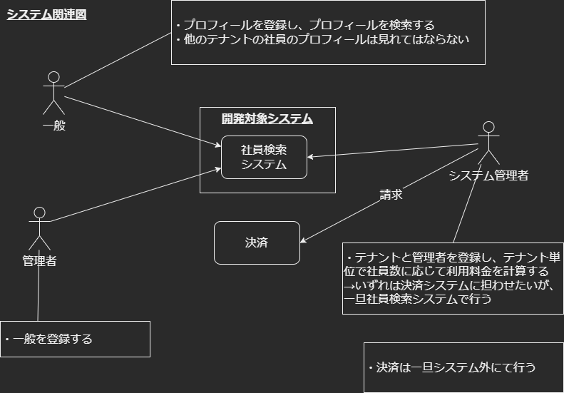
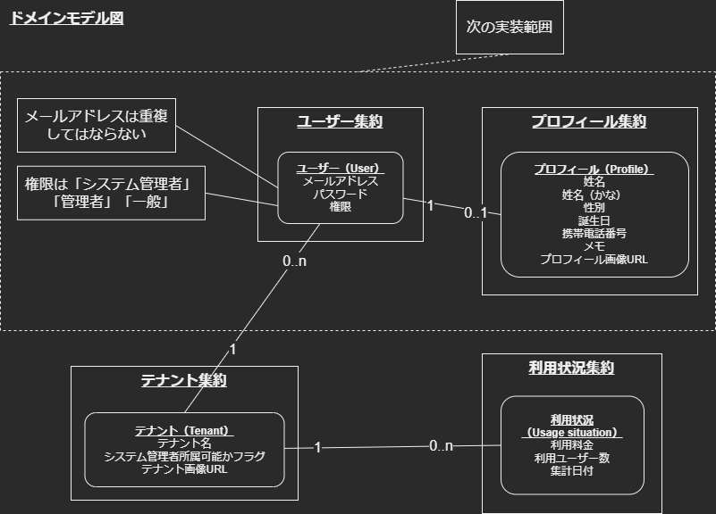

# Reinventing the wheel

[](./LICENSE)

[](https://circleci.com/gh/q23isline/reinventing_the_wheel)
[](https://github.com/q23isline/reinventing_the_wheel/actions/workflows/ci.yml)
[](https://codecov.io/gh/q23isline/reinventing_the_wheel)
[](https://github.com/phpstan/phpstan)
[](https://open.vscode.dev/q23isline/reinventing_the_wheel)

[](https://www.php.net)
[](https://cakephp.org)
[](https://dev.mysql.com)
[](https://www.nginx.com)

## はじめにやること

1. ソースダウンロード

    ```bash
    git clone 'https://github.com/q23isline/reinventing_the_wheel.git'
    ```

2. `config/.env.example`をコピーし、`config/.env`として貼り付ける
    - ファイル内の`SECURITY_SALT`の値は適当に書き換える

    ```bash
    cd reinventing_the_wheel
    cp config/.env.example config/.env
    ```

3. `config/app_local.example.php`をコピーし、`config/app_local.php`として貼り付ける

    ```bash
    cp config/app_local.example.php config/app_local.php
    ```

4. DB コンテナ起動時に Permission Denied で起動できない状態にならないように権限付与する

    ```bash
    sudo chmod -R ugo+w logs
    ```

5. アプリ立ち上げ

    ```bash
    docker compose build --no-cache
    docker compose down -v
    sudo rm -rf vendor
    sudo rm -rf node_modules
    docker create -it --name app reinventing_the_wheel-app bash
    sudo docker cp app:/var/www/html/vendor $(pwd)
    sudo docker cp app:/var/www/html/node_modules $(pwd)
    docker rm -f app
    sudo chown $(whoami):$(whoami) -R vendor
    sudo chown $(whoami):$(whoami) -R node_modules
    docker compose up -d
    docker exec -it app bin/cake migrations migrate
    docker exec -it app bin/cake migrations seed
    ```

## 日常的にやること

### システム起動

```bash
docker compose up -d
```

### システム終了

```bash
docker compose down
```

## 動作確認

### URL

- <http://localhost>

### ログイン情報

| Mail Address      | Password |
| ----------------- | -------- |
| admin@example.com | admin00  |

### Permission Denied対策

- ログイン後、画面にPermission Deniedエラーが表示される場合、以下を実行
  - 本番環境では適切に権限を付与すべきだがとりあえず動くようにフル権限を付与

```bash
sudo chmod -R 777 tmp
sudo chmod -R ugo+w logs
```

## コード静的解析＆ユニットテスト

```bash
docker exec -it app php composer.phar check
```

### コーディング標準チェック単体実行

```bash
# コーディング標準チェック実行
docker exec -it app ./vendor/bin/phpcs --colors -p src/ tests/
# コーディング標準チェック自動整形実行
docker exec -it app ./vendor/bin/phpcbf --colors -p src/ tests/
```

### 静的分析チェック単体実行

```bash
docker exec -it app ./vendor/bin/phpstan analyse
```

### ユニットテスト単体実行

```bash
# テスト実行
docker exec -it --env XDEBUG_MODE=coverage app ./vendor/bin/phpunit --colors=always
# カバレッジ生成
docker exec -it --env XDEBUG_MODE=coverage app ./vendor/bin/phpunit --coverage-html webroot/coverage
```

- カバレッジ確認URL
  - <http://localhost/coverage/index.html>

## sudoモデリング

- `docs/diagrams/src`配下の`.xml`ファイルにて定義
  - [diagrams.net](https://www.diagrams.net/)

<details>
<summary>システム関連図</summary>

</details>

<details>
<summary>ユースケース図</summary>

</details>

<details>
<summary>ドメインモデル図</summary>

</details>

<details>
<summary>オブジェクト図</summary>

</details>

## APIドキュメント

- `docs\api\src\reference`以下の`.yaml`ファイルにて定義
  - [Stoplight Studio](https://stoplight.io/studio/)ソフトに読み込ませることでメンテナンス可能
- APIドキュメントHTML化手順
  - nodejsインストール[ダウンロードリンク](https://nodejs.org/ja/download/)
  - 以下のコマンド実行

```bash
# HTML変換用ライブラリインストール（一回のみ実行）
npm install -g redoc-cli
# `yaml`ファイルをHTMLへ変換する
redoc-cli bundle xxxxxx.yaml
```

## PostmanによるAPIの動作確認

- Headersに以下を設定

| KEY          | VALUE                                            |
|--------------|--------------------------------------------------|
| Cookie       | PHPSESSID=xxxxxx; csrfToken=xxxxxx               |

- 【GET以外の場合】BodyのrawにJSONで以下を設定

```JSONC
{
    // 画面の HTML を表示し、input タグの name が _csrfToken の value
    "_csrfToken": "xxxxxxxxx",
    // .....
}
```

## デバッグ実行

### VS Codeの初期設定

- [VS Code | Marketplace | PHP Debug](https://marketplace.visualstudio.com/items?itemName=felixfbecker.php-debug)をインストールする
- VS CodeにXDebug用の構成ファイル（launch.json）を追加する

```JSONC
{
    "version": "0.2.0",
    "configurations": [
        {
            "name": "Listen for Xdebug",
            "type": "php",
            "request": "launch",
            "hostname": "0.0.0.0",
            "pathMappings": {
                "/var/www/html/": "${workspaceRoot}"
            },
            "environment": {
                // デバッグ時はログレベルを 7
                "XDEBUG_CONFIG": "log_level=7"
            }
        }
    ]
}
```

## ディレクトリ構成

<details>
<summary>オニオンアーキテクチャ</summary>

```text
reinventing_the_wheel
├src
│├Controller ：ユーザーインターフェイス（プレゼンテーション）層［MVCのC］
││└Api
││　└{version}
││　　└{functionName}Controller.php
│├Domain
││├Models ：ドメインモデル層
│││└{functionName}
│││　├Type
│││　│└{columnName}.php
│││　├I{functionName}Repository.php ：依存関係逆転の原則用
│││　├{functionName}.php
│││　└{functionName}Collection.php
││├Services ：ドメインサービス層
│││└{functionName}Service.php
││└Shared
││　└Exception
││　　├ExceptionItem.php
││　　└ValidateException.php
│├Infrastructure ：インフラ層
││├CakePHP ：MVCのMを呼び出す
│││└{functionName}
│││　└CakePHP{functionName}Repository.php
││└InMemory ：テスト用
││　└{functionName}
││　　└InMemory{functionName}Repository.php
│└UseCase ：アプリケーションサービス（ユースケース）層
│　└{functionName}
│　　├{functionName}{actionName}Command.php ：ファサード用
│　　├{functionName}{actionName}UseCase.php
│　　├{functionName}Data.php ：DTO用
│　　└{functionName}{actionName}Result.php ：出力整形用
└docs
　├api ：APIドキュメント
　│└src
　│　└reference
　│　　└{functionName}.{version}.yaml
　└diagrams ：sudoモデリングの図
　　└src
　　　└reinventing_the_wheel.drawio.xml
```

</details>
